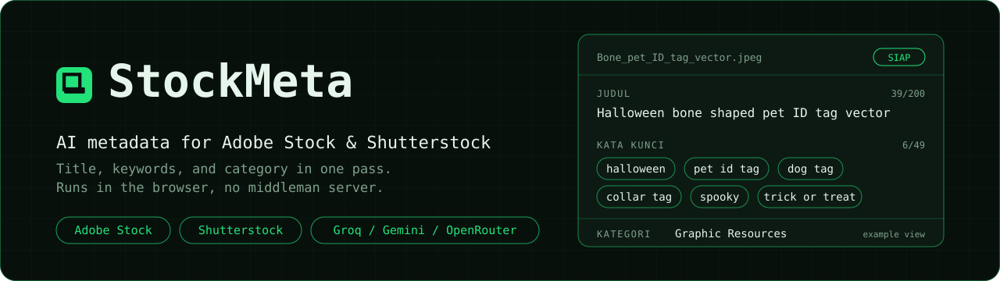
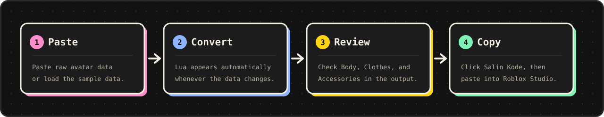
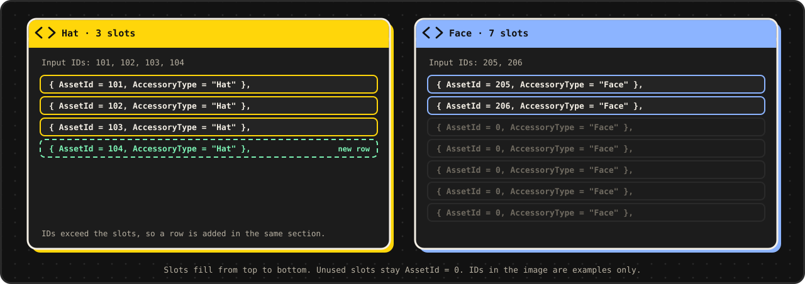
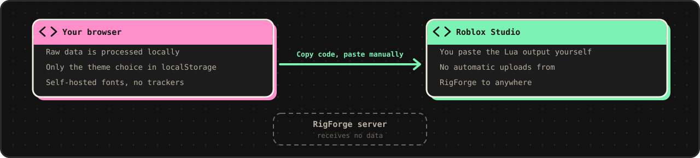

<div align="center">



<br>

[](https://rigforge-mocha.vercel.app/)


[Bahasa Indonesia](README.md) · [English](README.en.md)

**Turn raw Roblox avatar data into a Lua script for Roblox Studio.**
Runs in your browser. Pasted data never passes through a server.

[Try it now](https://rigforge-mocha.vercel.app/) ·
[Features](#features) ·
[How to use](#how-to-use) ·
[Input format](#input-format) ·
[Privacy](#privacy-and-security) ·
[Development](#local-development) ·
[Contributing](#contributing)

</div>

---

## Overview

Copying avatar IDs into a Lua template by hand is slow and easy to get wrong. RigForge reads raw avatar data (a token list or a JSON blob), arranges it into a fixed Lua template, and shows the result ready to copy.

Three principles guide the tool:

- **One page, one tool.** Paste data on the left, copy Lua on the right. No account, no routing, no extra steps.
- **A consistent template.** Every section has a minimum slot count, so the output always has the same shape and is easy to compare between avatars.
- **Locked down by tests.** The parser and generator are covered by 74 tests, including 26 snapshot cases, so conversion behavior never changes silently.

## Screenshots

<table>
  <tr>
    <td width="50%" align="center"><br><sub>Dark mode</sub></td>
    <td width="50%" align="center"><br><sub>Light mode</sub></td>
  </tr>
</table>

<sub>Interface preview with the built-in sample data. IDs in the images are examples only.</sub>

## Features

| | |
|---|---|
| **Automatic conversion** | Lua output appears as the data changes, with a short delay (about 0.2 s) so pasting large data doesn't stall the page. |
| **Two input styles** | A token list (`Head: 123`) or a JSON blob after `AccessoryBlob Data:`. Both can be used together. |
| **Universal template** | A minimum slot count per section. IDs fill from the top, unused slots stay `AssetId = 0`, and extra rows are added when IDs exceed the slots. |
| **Forgiving parser** | Tokens are case-insensitive. Recognizes `DynamicHead` and spelling variants of `TShirt` (`T-Shirt`, `Tshirt`). |
| **No duplicates** | Identical IDs within one section are written once. |
| **Sample data and Reset** | The page loads with sample data. One click to reload it, one click to clear. |
| **Force generate** | Re-runs the conversion immediately, without waiting for the delay. |
| **Copy code** | Copies the full Lua output to the clipboard in one click. |
| **Light and dark mode** | Follows the system, can be switched with the header button, and your choice is remembered in the browser. |
| **Accessible** | Skip-to-content link, ARIA labels, and keyboard focus rings with contrast checked in both modes. |

## How to use



1. **Open** [rigforge-mocha.vercel.app](https://rigforge-mocha.vercel.app/). The page loads with sample data and the result is already shown.
2. **Paste** raw avatar data into the **Data mentah** (raw data) panel. Click **Reset** first to start from empty.
3. **Check the result** in the **Hasil Lua** (Lua output) panel. Conversion runs automatically whenever the data changes.
4. Click **Generate Paksa** (force generate) to re-run the conversion right away.
5. **Review** the `Body`, `Clothes`, and `Accessories` sections.
6. Click **Salin Kode** (copy code), then paste into Roblox Studio.

> [!TIP]
> Not sure about your data format? Click **Contoh Data** (sample data), look at the input and output shapes, then replace the content with your own.

> The interface text is in Indonesian.

## Input format

The parser looks for tokens anywhere in the text, case-insensitively. Tokens may sit on separate lines.

| Section | Token | Notes |
|---|---|---|
| **Body** | `Head`, `Torso`, `LeftArm`, `RightArm`, `LeftLeg`, `RightLeg` | One ID per token. If `DynamicHead` is present, its value is used instead of `Head`. |
| **Classic clothing** | `Pants`, `Shirt`, `TShirt` | One ID per token. `TShirt` is also recognized as `T-Shirt` and `Tshirt`. |
| **Skin tone** | `Body Color: 242,215,205 (#F2D7CD)` | A hex code in parentheses takes priority. Without hex, the text after `Body Color:` is used. With neither, the value is `Pastel orange`. |
| **Accessories** | `Hat`, `HairAccessory`, `FaceAccessory`, `FrontAccessory`, `NeckAccessory`, `BackAccessory`, `ShoulderAccessory`, `WaistAccessory` | Comma-separated ID list. |
| **Blob** | `AccessoryBlob Data:` followed by a JSON array | Each item uses `AccessoryType` and `AssetId`. Layered clothing and accessory types go to the matching section. |

ID order within a section: the token list first, then items from the blob.

> [!NOTE]
> If the blob's JSON is invalid, the blob is ignored and the error is logged to the browser console. The rest of the data is still converted.

## Universal template

Every section has a minimum slot count. The full list lives in `LAYERED_GROUPS` and `ACCESSORY_GROUPS` in `src/lib/converter.ts`.

| Group | Sections and minimum slots |
|---|---|
| `Clothes.Layered` | `LeftShoe` 2, `RightShoe` 2, `TShirt` 3, `Shirt` 3, `Pants` 3, `Shorts` 3, `DressSkirt` 3, `Sweater` 3, `Jacket` 4 |
| `Accessories` | `Hat` 3, `Hair` 3, `Face` 7, `Front` 3, `Neck` 3, `Back` 3, `Shoulder` 3, `Waist` 3 |



| Situation | Behavior |
|---|---|
| Fewer IDs than slots | IDs fill slots from top to bottom. Remaining slots stay `AssetId = 0`. |
| More IDs than slots | Extra rows are added **in the same section**. |
| Accessory type not in the template | A **new section** is created at the end of `Accessories`. |
| Identical IDs in one section | Written **once**. |
| Empty input | The output panel is cleared. |

A real excerpt from the sample data (`FaceAccessory` holds two IDs, the other five slots stay zero):

```lua
Accessories = {
	-- ...
	{ AssetId = 90044197280959, AccessoryType = "Face" },
	{ AssetId = 15873662828, AccessoryType = "Face" },
	{ AssetId = 0, AccessoryType = "Face" },
	{ AssetId = 0, AccessoryType = "Face" },
	{ AssetId = 0, AccessoryType = "Face" },
	{ AssetId = 0, AccessoryType = "Face" },
	{ AssetId = 0, AccessoryType = "Face" },
	-- ...
},
```

> [!IMPORTANT]
> The `Scaling` values (all `0`), `Face = 0`, `UserId = 0`, and the default skin tone `Pastel orange` are hardcoded in `converter.ts`. If you change them, also update `src/lib/__fixtures__/golden.json`, because the snapshot output changes with them.

## Privacy and security



- Pasted data is **processed in the browser**. This app's server never receives it.
- The app uses no analytics or trackers. The only thing stored in `localStorage` is the theme choice (`rl-theme`).
- Fonts are self-hosted through Fontsource, with no Google Fonts.
- `vercel.json` sets security headers: `X-Content-Type-Options`, `X-Frame-Options: DENY`, `Referrer-Policy`, and `Permissions-Policy`.

## Known limitations

- **One avatar per conversion.** The result replaces the panel content; nothing is appended.
- **Data is not saved.** After a reload, the panel is filled with the sample data again. Only the theme choice is remembered.
- **Results still need testing** in Roblox Studio before use, especially for data from varying sources.
- **No download button.** The result is copied to the clipboard and pasted into Studio yourself.
- This tool is independent and **not affiliated with Roblox Corporation**. "Roblox" is a trademark of Roblox Corporation, used only to describe what the tool does.

## Local development

Prerequisites: **Node.js 22** and npm.

```bash
git clone https://github.com/akndrn000/rigforge.git
cd rigforge
npm install
npm run dev        # http://localhost:5173
```

| Command | Purpose |
|---|---|
| `npm run dev` | Starts the development server. |
| `npm run build` | Type-checks, then creates a production build in `dist/`. |
| `npm run preview` | Tries the build locally. |
| `npm run test` | Runs unit tests (Vitest). |
| `npm run typecheck` | Checks TypeScript types. |

No environment variables are required.

### Folder structure

```
src/
  main.tsx              App entry point
  App.tsx               Single-page layout: Header + Converter + Footer
  components/           Converter, Header, Footer, Icon
  hooks/                useTheme (light/dark theme, stored in localStorage)
  lib/
    converter.ts        Parser + Lua generator (the core)
    converter.test.ts   74 tests: snapshots + universal template behavior
    __fixtures__/       golden.json (26 snapshot cases)
    sample.ts           Data for the "Contoh Data" button
  styles/               tokens.css (color, shape, font), base.css, site.css
public/                 favicon, brand.svg, iOS icon, Open Graph image
docs/                   DESIGN.md (design system), export-assets.py, images/
```

### Tech stack

- **Vite**, **React 19**, and **TypeScript**
- **Plain CSS** with design tokens, neobrutalism style (thick borders, hard shadows without blur, bright block palette)
- **JetBrains Mono** through Fontsource as the only font
- **Vitest** for unit tests

The visual guide is in [`docs/DESIGN.md`](docs/DESIGN.md).

## Deploy to Vercel

Connect this repo to the Vercel Dashboard, or deploy from the terminal:

```bash
npx vercel          # preview
npx vercel --prod   # production
```

Vercel detects Vite automatically. `vercel.json` already sets the build command (`npm run build`), the output folder (`dist`), and security headers. No environment variables need to be set.

## Contributing

Feedback and fixes are welcome. Before opening a pull request, run `npm run test` and `npm run build` until both pass. If your change affects the Lua output, update `golden.json` and explain why in the PR description.

## License

Released under the [MIT License](LICENSE).

---

<div align="center">
<sub>RigForge. An independent tool for Roblox avatars. Processed locally in the browser.</sub>
</div>
