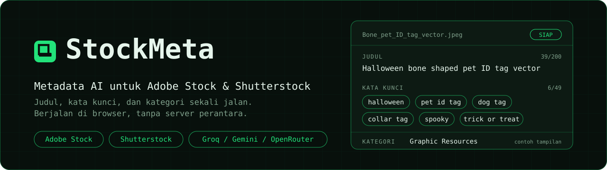
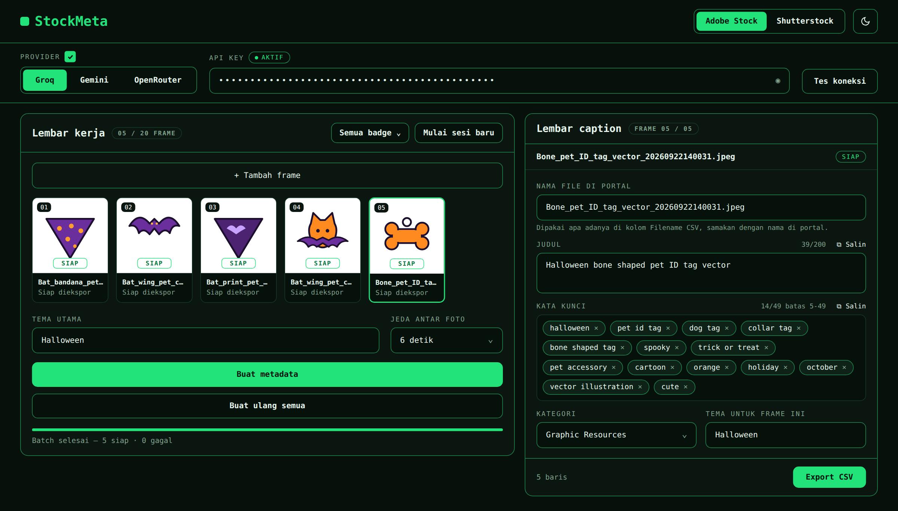
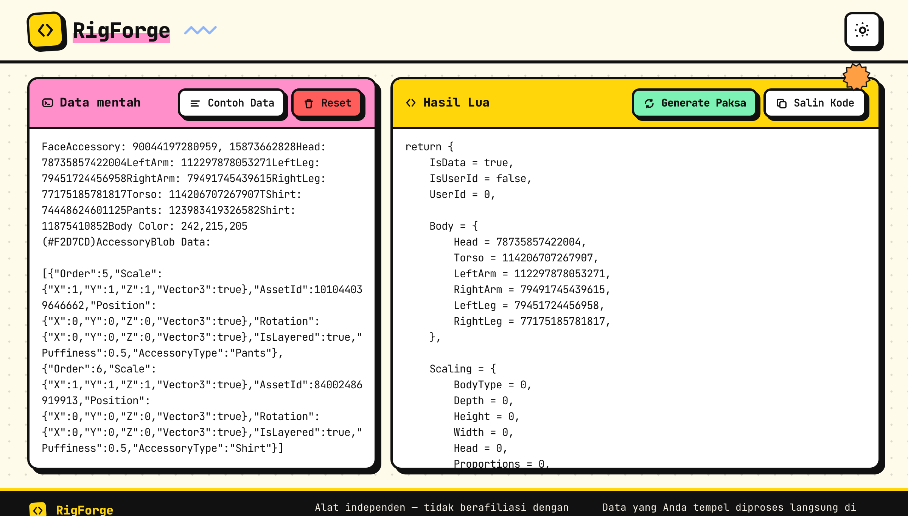
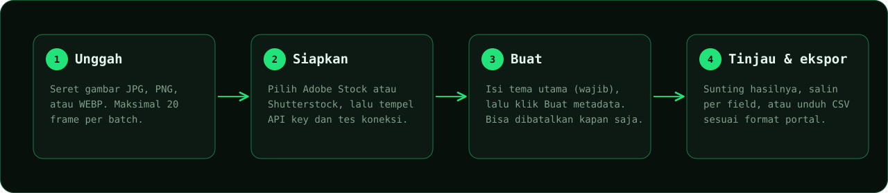
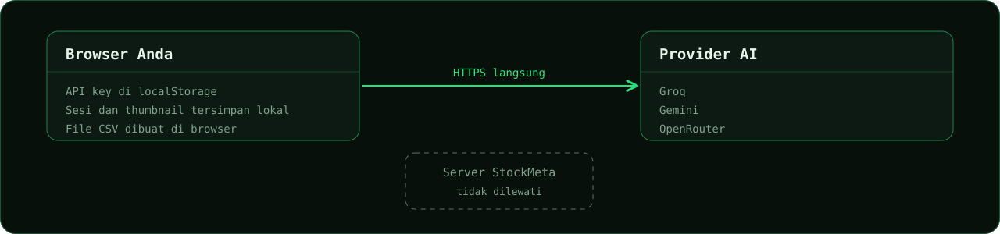

<div align="center">



<br>

[](https://stockmeta-gold.vercel.app/)


[Bahasa Indonesia](README.md) · [English](README.en.md)

**Generate titles, descriptions, keywords, and categories for Adobe Stock and Shutterstock in batches.**
It runs in your browser. Your API key never passes through this app's server.

[Try it](https://stockmeta-gold.vercel.app/) ·
[Features](#features) ·
[How to use](#how-to-use) ·
[CSV format](#csv-format) ·
[Privacy](#privacy-and-security) ·
[Development](#local-development) ·
[Contributing](#contributing)

</div>

---

## Overview

Filling in metadata one file at a time is the slowest part of stock contributing. StockMeta reads your images with an AI model (Groq, Gemini, or OpenRouter), writes metadata that follows each portal's rules, and exports a CSV that is ready to import.

Three principles guide the tool:

- **Portal-specific.** Adobe Stock and Shutterstock have different rules and CSV formats, so each has its own prompt, validation, and export template.
- **Grounded in the image.** The main theme is required as context, but the result must still match what is actually visible in the picture.
- **You stay in control.** Every result can be edited before export. Nothing is silently truncated or changed.

## Preview

<table>
  <tr>
    <td width="50%" align="center"><br><sub>Dark mode</sub></td>
    <td width="50%" align="center"><br><sub>Light mode</sub></td>
  </tr>
</table>

<sub>Interface preview with a sample Halloween batch. The images and metadata shown are examples only.</sub>

## Features

| | |
|---|---|
| **Batches of up to 20 frames** | Upload JPG, PNG, or WEBP files by drag and drop or the file picker. |
| **Two platforms, one session** | Switch between Adobe Stock and Shutterstock without losing results. Metadata is stored separately per platform. |
| **Three AI providers** | Groq, Gemini, and OpenRouter. Keys are verified with the Test connection button first. |
| **Required main theme** | One theme for the whole batch, with an option to override it per frame. |
| **Controlled processing** | Sequential, cancellable, with automatic retry on rate limits and a status per frame: waiting, processing, ready, failed. |
| **Per-frame editor** | Edit the title or description, keyword chips, official category, and non-blocking improvement tips. |
| **CSV export** | Follows each portal's official template. You can also copy any field with one click. |
| **Delay between photos** | Choose 3, 6, 12, or 20 seconds (default 6) to stay under provider limits. |
| **Light and dark mode** | Follows your system, with a manual override. Sessions are saved in the browser automatically. |

## How to use



1. **Upload** images to the worksheet by dragging them in or clicking the upload area.
2. **Pick a platform** at the top right: Adobe Stock or Shutterstock.
3. **Pick a provider**, paste your **API key**, and click **Test connection**. The key is saved only if the test passes.
4. Enter the **Main theme**, for example `Halloween`. This field is required, and the Generate button stays disabled until it is filled.
5. Adjust the **Delay between photos** if your provider often rate-limits you.
6. Click **Generate metadata**. Progress is shown per frame and you can cancel at any time.
7. **Review and edit** the output in the caption sheet.
8. **Copy** individual fields, or click **Export CSV** to download a file ready for import.

> [!TIP]
> For large batches, start with 3 to 5 images. Check the results and the CSV format in the portal, then continue with the full batch.

## AI providers

| Provider | When to use it | Notes |
|---|---|---|
| **Groq** | A fast first choice. | The free tier has a tokens-per-minute cap, so large batches may wait for the limit to reset. |
| **Gemini** | An alternative when Groq is busy. | The free tier is limited per minute and per day, and can occasionally be busy. |
| **OpenRouter** | Access to many models through one key. | Availability, pricing, and image support depend on the model you choose. |

Free-tier limits change over time. Check each provider's console for current numbers.

If you often see **Waiting for limit reset**, raise the **Delay between photos** to 12 or 20 seconds. Retries run automatically (up to 5 attempts), and frames that still fail can be reprocessed with the **Retry failed frames** button.

Keywords are derived from the image's visual facts: colors and specific claims (for example `kitten`) are verified against those facts, generic words (`vector`, `illustration`, `cute`, and the like) are placed last, and every removed or moved word is recorded under the improvement suggestions.

Gemini uses the fixed model `gemini-3.1-flash-lite` (change it in `src/lib/providers/gemini-config.ts`). To stay free, use an API key from a Google project without billing and check its plan label at `aistudio.google.com/apikey`; quota limits are shown at `aistudio.google.com/rate-limit`. On the free tier, Google may use inputs to improve its products, so avoid uploading unreleased images.

## CSV format

Exports follow each portal's official template.

| | Adobe Stock | Shutterstock |
|---|---|---|
| **Columns** | `Filename, Title, Keywords, Category, Releases` | `Filename, Description, Keywords, Categories` |
| **Title / description** | Title up to 200 characters, no commas (commas become spaces on export). | Description is a full sentence, not a word list. |
| **Keywords** | One cell, comma-separated, 5 to 49 keywords. | One cell, comma-separated. |
| **Category** | A number from 1 to 21 following Adobe's official list. `Releases` is left empty. | 1 to 2 official category names in one cell, comma-separated. |

Only rows that already have content for the selected platform are exported.

> [!IMPORTANT]
> Import one or two exported files into the portal first before using the export for many files. Portal rules and templates can change at any time.

## Privacy and security



- Your API key is stored in your browser's **localStorage** and sent **directly from the browser to the provider**. This app's server never receives it.
- The app uses no trackers.
- Use a **dedicated API key** for this tool, not your main one, and restrict its permissions in the provider console.
- **Do not use a shared computer** without clearing the session. Anyone opening the same browser can see the stored key. You can hide or remove the key from its field.

## Known limitations

- A maximum of **20 frames per batch**.
- **Original files are not kept** after a page reload. A session stores only thumbnails and metadata. To regenerate, upload the images again with the same file names.
- **AI output still needs review.** A subject may be misread and keywords need curation. Portal limits only raise warnings and are never silently truncated.
- This tool is independent and **not affiliated with Adobe or Shutterstock**. Make sure your metadata meets each portal's current contributor guidelines.

## Local development

Prerequisites: Node.js and npm.

```bash
git clone https://github.com/akndrn000/stockmeta.git
cd stockmeta
npm install
npm run dev        # http://localhost:3000
```

| Command | Purpose |
|---|---|
| `npm run dev` | Start the development server. |
| `npm run build` | Create a production build. |
| `npm run test` | Run unit tests (Vitest). |
| `npm run typecheck` | Check TypeScript types. |
| `npm run lint` | Run ESLint. |

No environment variables are needed. Users enter all keys in the browser.

### Folder structure

```
src/
  app/          layout, page, globals.css (color tokens), icon.svg
  components/   Header, ProviderPanel, Worksheet, CaptionSheet, KeywordEditor, ...
  hooks/        useSession, useProvider, useBatch, useTheme
  lib/          pure logic: batch, csv, prompt, validate, storage, providers/
scripts/        live-test.ts (manual provider test, not part of the build)
docs/           DESIGN.md (design system), MIGRATION.md (migration notes), images/
```

### Tech stack

- **Next.js 16** (App Router), **React 19**, and **TypeScript** in strict mode
- **Tailwind CSS v4** with color tokens via `@theme`
- **Vitest** with jsdom for unit tests, **ESLint** for linting
- **JetBrains Mono** via `next/font` as the only typeface

The visual guidelines are in [`docs/DESIGN.md`](docs/DESIGN.md).

## Deploy to Vercel

Connect this repo in the Vercel Dashboard, or deploy from the terminal:

```bash
vercel deploy
```

The default build uses `npm run build`, and no environment variables need to be set.

## Contributing

Feedback and fixes are welcome. Read [CONTRIBUTING.md](CONTRIBUTING.md) for the workflow, code standards, and how to report bugs. The change history is in [CHANGELOG.md](CHANGELOG.md).

## License

Released under the [MIT License](LICENSE).

---

<div align="center">
<sub>StockMeta. An independent tool for stock contributors. Processed locally in the browser.</sub>
</div>
