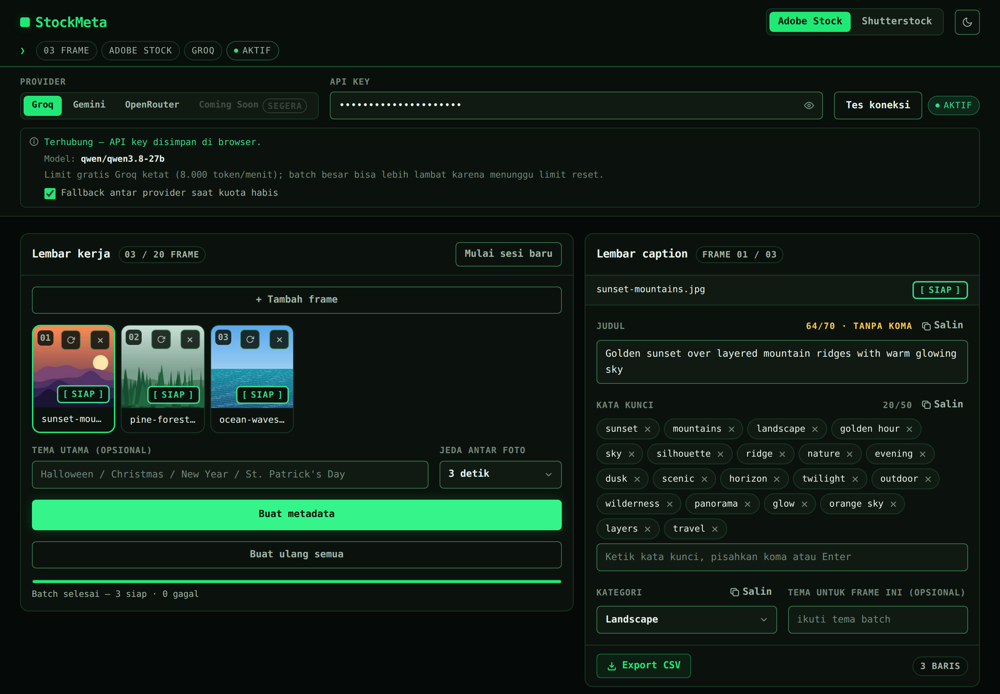
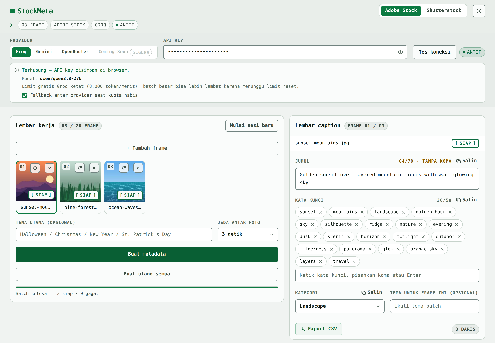

<div align="center">


<br>

[](https://stockmeta-one.vercel.app)
[](https://nextjs.org/)
[](https://react.dev/)
[](https://www.typescriptlang.org/)
[](https://tailwindcss.com/)
[](https://vitest.dev/)
[](./LICENSE)

**[Demo Live](https://stockmeta-one.vercel.app) · [Fitur](#fitur) · [Cara Pakai](#cara-pakai) · [Provider AI](#provider-ai) · [Format CSV](#format-csv) · [Keamanan](#keamanan-dan-privasi) · [Laporkan Bug](https://github.com/akndrn000/stockmeta/issues)**

</div>

<br>

> Upload foto, biarkan AI menulis **judul, kata kunci, dan kategori** secara batch, sunting hasilnya, lalu ekspor **CSV** sesuai format Adobe Stock atau Shutterstock. Semua berjalan di browser, dengan API key milikmu sendiri.

<br>

<div align="center">


<br>
<sub>Tema gelap dan terang. Gambar dan metadata pada tangkapan layar adalah data contoh untuk ilustrasi.</sub>
</div>

<br>

## Ringkasan

Kontributor foto stok membutuhkan metadata yang akurat untuk setiap foto: judul, kata kunci, dan kategori sesuai aturan tiap portal. StockMeta mengerjakannya secara batch langsung di browser. API key milik pengguna (Groq, Gemini, atau OpenRouter) dikirim dari browser ke provider tanpa perantara server aplikasi, lalu hasilnya dapat disunting dan diekspor sebagai CSV siap impor.

## Fitur

| | |
| --- | --- |
| **Batch sampai 20 frame** | Upload JPG, PNG, atau WEBP lewat drag-drop atau tombol pilih file. |
| **Dua platform sekaligus** | Adobe Stock dan Shutterstock dalam satu sesi. Hasil tersimpan per platform, jadi ganti platform tidak menghilangkan pekerjaan. |
| **Proses batch yang tangguh** | Berurutan, bisa dibatalkan, retry otomatis saat kena limit, dan status per frame (menunggu, memproses, siap, gagal). |
| **Fallback antar provider** | Saat kuota harian habis atau terjadi `503` setelah retry habis, frame dialihkan ke provider lain yang key-nya tersimpan. Bisa dimatikan. |
| **Edit manual** | Judul atau deskripsi, kata kunci berbentuk chip, kategori resmi, tema per foto, dan saran perbaikan yang tidak memblokir. |
| **Ekspor CSV** | Mengikuti template resmi portal, atau salin per field dengan satu klik. |
| **Jeda antar foto** | Dapat diatur 3, 6, 12, atau 20 detik (default 6) untuk menghindari limit. |
| **Mode Analisis** | Nilai kelayakan upload per foto per platform (`layak` / `berpotensi-ditolak` / `perlu-tinjau`) beserta alasannya, berdampingan dengan Mode Metadata. |
| **Nyaman dipakai** | Mode siang/malam (mengikuti sistem, bisa di-override) dan sesi tersimpan otomatis di browser. |

## Cara Pakai

1. **Upload** foto ke *Lembar kerja* (drag-drop atau klik area upload).
2. **Pilih platform**, Adobe Stock atau Shutterstock, di header.
3. **Pilih provider** (Groq sebagai default, atau Gemini) lalu **tempel API key**.
4. Klik **Tes koneksi**. Key hanya disimpan kalau tes lulus.
5. Isi **tema batch** (opsional), misalnya `Halloween`.
6. Klik **Buat metadata**. Progres tampil per frame dan bisa **Batalkan** kapan saja.
7. **Edit** hasilnya di *Lembar caption*.
8. **Salin** per field, atau klik **Export CSV** untuk mengunduh file.

> [!TIP]
> Kalau sering muncul **"Menunggu limit reset"**, naikkan **Jeda antar foto** menjadi 12 atau 20 detik. Frame yang tetap gagal bisa diproses ulang lewat tombol **Coba lagi frame gagal**.

## Provider AI

Setiap provider memakai **satu model tetap**, tanpa pemilihan model dinamis. Nama model diverifikasi dari `src/lib/providers/models.ts`.

| Provider | Model | Batas gratis |
| --- | --- | --- |
| **Groq** (default) | `qwen/qwen3.8-27b` | Perkiraan ±8.000 token/menit, dapat berubah sewaktu-waktu. [Dokumentasi limit Groq](https://console.groq.com/docs/rate-limits) |
| **Gemini** | `gemini-3.5-flash-lite` | Kuota harian gratis. `429` bertanda kuota harian berarti kuota hari itu habis. [Dokumentasi rate limit Gemini](https://ai.google.dev/gemini-api/docs/rate-limits) |
| **OpenRouter** (cadangan) | `openrouter/free` | Perkiraan ±20 request/hari tanpa isi saldo, dapat berubah sewaktu-waktu. [Dokumentasi OpenRouter](https://openrouter.ai/docs) |

<details>
<summary><b>Perilaku retry dan fallback</b></summary>

<br>

Berdasarkan `src/lib/providers/retry.ts` dan `src/lib/providers/fallback.ts`:

- Limit per menit (`429` biasa) di-retry otomatis: total maksimal **3 percobaan**, menunggu ±20 detik atau sesuai header `retry-after`.
- Error `503` atau sibuk di-retry dengan backoff 5 detik lalu 10 detik.
- Kuota **harian** habis (`429` bertanda kuota harian) tidak di-retry. Frame dialihkan ke provider lain yang key-nya tersimpan, atau gagal dengan pesan yang jelas bila tidak ada key cadangan.
- Fallback bisa dimatikan lewat toggle **Fallback antar provider** di panel provider (default aktif).

</details>

## Format CSV

Ekspor mengikuti template resmi masing-masing portal (lihat `src/lib/csv.ts` dan `src/lib/validate.ts`).

| Aturan | **Adobe Stock** | **Shutterstock** |
| --- | --- | --- |
| Kolom | `Filename, Title, Keywords, Category, Releases` | `Filename, Description, Keywords, Categories` |
| Judul / deskripsi | Judul maks 200 karakter (koma aman, sel CSV di-quote) | Deskripsi berupa kalimat utuh maks 2048 karakter, bukan daftar kata |
| Kategori | Berupa **nomor** (1-21) sesuai daftar resmi Adobe; kolom `Releases` dikosongkan | **1-2 nama** resmi dalam satu sel, dipisah koma |
| Kata kunci | Satu sel dipisah koma, maksimal 49 (yang paling penting dulu) | Satu sel dipisah koma, maksimal 50 |
| Nama file | Saran bila melebihi 30 karakter (termasuk ekstensi) | Tidak ada batas khusus di aplikasi |

- Judul Adobe yang dihasilkan AI dibatasi 200 karakter saat parsing. Edit manual yang melebihi batas tidak dipotong diam-diam saat ekspor, melainkan memunculkan saran validasi.
- Hanya baris yang sudah punya isi untuk platform tersebut yang diekspor. File dikirim sebagai UTF-8 dengan BOM dan baris CRLF, plus proteksi injeksi formula untuk sel berawalan `=`, `+`, `-`, atau `@`.
- Saran validasi lain (kata kunci minimal 5 untuk Adobe dan 7 untuk Shutterstock, deskripsi minimal 5 kata dan maksimal 2048 karakter, kategori wajib diisi) bersifat non-pemblokir.

> [!IMPORTANT]
> Sebaiknya impor CSV hasil unduhan ke portal masing-masing **sekali dulu** untuk memastikan formatnya diterima sebelum dipakai untuk banyak file.

## Keamanan dan Privasi

- API key disimpan di **localStorage browser** (`stockmeta_groq_key`, `stockmeta_gemini_key`, `stockmeta_openrouter_key`) dan hanya ditulis setelah tes koneksi lulus.
- Key dan gambar dikirim **langsung dari browser ke server provider** (`api.groq.com`, `generativelanguage.googleapis.com`, `openrouter.ai`). Repo ini tidak punya API route backend, jadi tidak ada server perantara.
- Yang dikirim ke provider: API key (sebagai otorisasi), teks prompt, dan gambar dalam format base64. Tidak ada server aplikasi yang menerima data, dan tidak ada analytics atau pelacak di kode.
- Gunakan **API key khusus** untuk aplikasi ini (bukan key utamamu) dan batasi haknya di konsol provider.

> [!WARNING]
> **Jangan memakai komputer bersama** tanpa menghapus sesi. Siapa pun yang membuka browser yang sama bisa melihat key tersimpan. Ada tombol lihat/sembunyikan key, dan kamu bisa menghapusnya dari field.

## Memulai (Development)

**Stack:** Next.js 16 (App Router), React 19, TypeScript strict, Tailwind CSS v4, Vitest + jsdom, ESLint. Font JetBrains Mono via `next/font`.

Prasyarat: Node.js (versi LTS disarankan) dan npm.

```bash
git clone https://github.com/akndrn000/stockmeta.git
cd stockmeta
npm install
npm run dev      # buka http://localhost:3000
```

| Script | Fungsi |
| --- | --- |
| `npm run dev` | Menjalankan server development Next.js |
| `npm run build` | Build produksi |
| `npm run start` | Menjalankan hasil build produksi |
| `npm run lint` | Cek ESLint |
| `npm run test` | Unit test sekali jalan (Vitest) |
| `npm run typecheck` | Cek tipe TypeScript tanpa emit (`tsc --noEmit`) |

<details>
<summary><b>Live-test provider manual</b></summary>

<br>

Tidak ikut build. Key hanya dibaca dari environment variable.

```bash
GEMINI_KEY=... npx tsx scripts/live-test.ts gemini foto.jpg adobe "Halloween"
GROQ_KEY=... npx tsx scripts/live-test.ts groq foto.jpg shutterstock
OPENROUTER_KEY=... npx tsx scripts/live-test.ts openrouter foto.jpg adobe
```

</details>

## Testing dan Kualitas

```bash
npm run lint && npm run typecheck && npm run test
```

Konvensi kode ada di [`AGENTS.md`](./AGENTS.md): satu modul satu seam dengan interface kecil. `src/lib/*` berisi logika murni tanpa DOM/React, `src/hooks/*` berisi state React, `src/components/*` berisi UI. Logika murni tidak mengimpor React, dan provider tidak mengimpor komponen.

## Deploy

Tidak ada environment variable yang dibutuhkan. Semua key diisi pengguna di browser.

```bash
vercel deploy
```

Atau hubungkan repo ini ke Vercel Dashboard. Build default: `npm run build`.

<details>
<summary><b>Struktur folder</b></summary>

<br>

```text
src/
  app/            layout.tsx, page.tsx, globals.css (token warna), icon.svg
  components/     Header, ProviderPanel, Worksheet, CaptionSheet, KeywordEditor,
                  Panel, CopyButton, ThemeToggle, Footer, InlineScript
  hooks/          useSession, useProvider, useBatch, useTheme
  lib/            batch, csv, prompt, validate, storage, limits, categories,
                  metadata, keywords, frames, image, fileStore, types
  lib/providers/  groq, gemini, openrouter, fallback, retry, models, types, index, http
scripts/          live-test.ts (tes provider manual, tidak ikut build)
docs/             DESIGN.md, MIGRATION.md, banner dan tangkapan layar README
```

</details>

## Batasan yang Diketahui

- **Maksimal 20 frame per batch.**
- **File asli tidak disimpan setelah refresh.** Sesi menyimpan thumbnail dan metadata saja. Untuk generate ulang, upload ulang gambar dengan nama yang sama.
- **Hasil AI tetap perlu ditinjau manual.** Subjek bisa salah baca dan kata kunci perlu dikurasi. Batas portal (judul Adobe maks 200 karakter, kata kunci maks 49 untuk Adobe / 50 untuk Shutterstock, deskripsi Shutterstock maks 2048 karakter) hanya berupa saran, kecuali pemotongan 200 karakter pada output mentah model.
- **Kategori bisa terisi otomatis oleh sistem** bila nama dari model tidak cocok dengan daftar resmi. Hasil seperti ini ditandai dengan saran *"Kategori dipilih otomatis oleh sistem, periksa kembali."*

## Kontribusi

1. Fork repo ini dan buat branch dari `main`.
2. Baca [`AGENTS.md`](./AGENTS.md) sebelum mengubah kode dan ikuti konvensi modul yang ada.
3. Pastikan semua cek lolos sebelum membuka PR:

   ```bash
   npm run lint && npm run typecheck && npm run test
   ```

4. Buka pull request dengan deskripsi singkat tentang perubahanmu.

## Lisensi dan Disclaimer

Dilisensikan di bawah **MIT**. Lihat [LICENSE](./LICENSE) untuk teks lengkapnya (© 2026 akndrn000).

"Adobe Stock", "Shutterstock", "Groq", dan "Gemini/Google" adalah merek dagang pemiliknya masing-masing. Proyek ini tidak berafiliasi dengan, disponsori, atau didukung oleh mereka.
