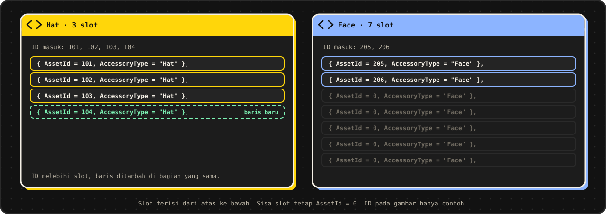

<div align="center">


<br>

[](https://rigforge-mocha.vercel.app/)


[Bahasa Indonesia](README.md) · [English](README.en.md)

**Ubah data mentah avatar Roblox menjadi script Lua untuk Roblox Studio.**
Berjalan di browser Anda. Data yang ditempel tidak pernah melewati server.

[Coba sekarang](https://rigforge-mocha.vercel.app/) ·
[Fitur](#fitur) ·
[Cara pakai](#cara-pakai) ·
[Format input](#format-input) ·
[Privasi](#privasi-dan-keamanan) ·
[Pengembangan](#pengembangan-lokal) ·
[Kontribusi](#kontribusi)

</div>

---

## Ringkasan

Menyalin ID avatar satu per satu ke template Lua itu lambat dan mudah salah ketik. RigForge membaca data mentah avatar (daftar token atau blob JSON), menyusunnya ke template Lua yang tetap, lalu menampilkan hasilnya siap salin.

Ada tiga hal yang menjadi pegangan alat ini:

- **Satu halaman, satu alat.** Tempel data di kiri, salin hasil Lua di kanan. Tanpa akun, tanpa routing, tanpa langkah tambahan.
- **Template yang konsisten.** Setiap bagian punya jumlah slot minimum, jadi bentuk output selalu sama dan mudah dibandingkan antar avatar.
- **Terkunci oleh tes.** Parser dan generator dijaga 74 tes, termasuk 26 kasus snapshot, supaya perilaku konversi tidak berubah diam-diam.

## Tampilan

<table>
  <tr>
    <td width="50%" align="center"><br><sub>Mode malam</sub></td>
    <td width="50%" align="center"><br><sub>Mode siang</sub></td>
  </tr>
</table>

<sub>Pratinjau antarmuka dengan Contoh Data bawaan. ID pada gambar hanya contoh.</sub>

## Fitur

| | |
|---|---|
| **Konversi otomatis** | Hasil Lua muncul saat data berubah, dengan jeda singkat (sekitar 0,2 detik) supaya tempel data besar tidak menahan halaman. |
| **Dua cara input** | Daftar token (`Head: 123`) atau blob JSON setelah `AccessoryBlob Data:`. Keduanya bisa dipakai bersamaan. |
| **Template universal** | Jumlah slot minimum per bagian. ID mengisi dari atas, sisa slot tetap `AssetId = 0`, dan baris baru ditambahkan bila ID melebihi slot. |
| **Parser yang toleran** | Token tidak peka huruf besar-kecil. Mengenali `DynamicHead` dan variasi penulisan `TShirt` (`T-Shirt`, `Tshirt`). |
| **Tanpa duplikat** | ID identik dalam satu bagian hanya ditulis sekali. |
| **Contoh Data dan Reset** | Halaman langsung terisi data contoh. Satu klik untuk memuat ulang, satu klik untuk mengosongkan. |
| **Generate Paksa** | Menjalankan ulang konversi seketika, tanpa menunggu jeda. |
| **Salin Kode** | Menyalin seluruh hasil Lua ke clipboard dengan satu klik. |
| **Mode siang dan malam** | Mengikuti sistem, bisa diganti manual lewat tombol di header, dan pilihan tersimpan di browser. |
| **Aksesibel** | Tautan lewati ke konten, label ARIA, dan cincin fokus keyboard yang kontrasnya diperiksa di kedua mode. |

## Cara pakai


1. **Buka** [rigforge-mocha.vercel.app](https://rigforge-mocha.vercel.app/). Halaman langsung terisi Contoh Data dan hasilnya sudah tampil.
2. **Tempel** data mentah avatar di panel **Data mentah**. Klik **Reset** dulu bila ingin mulai dari kosong.
3. **Lihat hasilnya** di panel **Hasil Lua**. Konversi berjalan otomatis setiap data berubah.
4. Klik **Generate Paksa** bila ingin menjalankan ulang konversi saat itu juga.
5. **Tinjau** bagian `Body`, `Clothes`, dan `Accessories` pada hasil.
6. Klik **Salin Kode**, lalu tempel ke Roblox Studio.

> [!TIP]
> Tidak yakin dengan format data Anda? Klik **Contoh Data**, lihat bentuk input dan outputnya, lalu ganti isinya dengan data Anda.

## Format input

Parser mencari token di mana pun dalam teks, tidak peka huruf besar-kecil. Token boleh berada di baris terpisah.

| Bagian | Token | Catatan |
|---|---|---|
| **Tubuh** | `Head`, `Torso`, `LeftArm`, `RightArm`, `LeftLeg`, `RightLeg` | Satu ID per token. Bila `DynamicHead` ada, nilainya dipakai menggantikan `Head`. |
| **Pakaian klasik** | `Pants`, `Shirt`, `TShirt` | Satu ID per token. `TShirt` juga dikenali sebagai `T-Shirt` dan `Tshirt`. |
| **Warna kulit** | `Body Color: 242,215,205 (#F2D7CD)` | Kode hex dalam kurung dipakai lebih dulu. Tanpa hex, teks setelah `Body Color:` dipakai. Tanpa keduanya, nilainya `Pastel orange`. |
| **Aksesori** | `Hat`, `HairAccessory`, `FaceAccessory`, `FrontAccessory`, `NeckAccessory`, `BackAccessory`, `ShoulderAccessory`, `WaistAccessory` | Daftar ID dipisah koma. |
| **Blob** | `AccessoryBlob Data:` diikuti array JSON | Tiap item memakai `AccessoryType` dan `AssetId`. Tipe pakaian berlapis dan aksesori masuk ke bagian yang sesuai. |

Urutan ID dalam satu bagian: daftar token lebih dulu, lalu item dari blob.

> [!NOTE]
> Bila JSON pada blob tidak valid, blob diabaikan dan galatnya dicatat di konsol browser. Sisa data tetap dikonversi.

## Template universal

Setiap bagian punya jumlah slot minimum. Daftar lengkapnya ada di `LAYERED_GROUPS` dan `ACCESSORY_GROUPS` pada `src/lib/converter.ts`.

| Kelompok | Bagian dan slot minimum |
|---|---|
| `Clothes.Layered` | `LeftShoe` 2, `RightShoe` 2, `TShirt` 3, `Shirt` 3, `Pants` 3, `Shorts` 3, `DressSkirt` 3, `Sweater` 3, `Jacket` 4 |
| `Accessories` | `Hat` 3, `Hair` 3, `Face` 7, `Front` 3, `Neck` 3, `Back` 3, `Shoulder` 3, `Waist` 3 |



| Situasi | Perilaku |
|---|---|
| ID lebih sedikit dari slot | ID mengisi slot dari atas ke bawah. Sisa slot tetap `AssetId = 0`. |
| ID melebihi jumlah slot | Baris baru ditambahkan **di bagian yang sama**. |
| Tipe aksesori tidak ada di template | Dibuatkan **bagian baru** di akhir `Accessories`. |
| ID identik dalam satu bagian | Hanya ditulis **sekali**. |
| Input kosong | Panel hasil dikosongkan. |

Potongan hasil nyata dari Contoh Data (`FaceAccessory` berisi dua ID, lima slot sisanya tetap nol):

```lua
Accessories = {
	-- ...
	{ AssetId = 90044197280959, AccessoryType = "Face" },
	{ AssetId = 15873662828, AccessoryType = "Face" },
	{ AssetId = 0, AccessoryType = "Face" },
	{ AssetId = 0, AccessoryType = "Face" },
	{ AssetId = 0, AccessoryType = "Face" },
	{ AssetId = 0, AccessoryType = "Face" },
	{ AssetId = 0, AccessoryType = "Face" },
	-- ...
},
```

> [!IMPORTANT]
> Nilai `Scaling` (semuanya `0`), `Face = 0`, `UserId = 0`, dan warna kulit bawaan `Pastel orange` ditulis tetap di `converter.ts`. Bila Anda mengubahnya, perbarui juga `src/lib/__fixtures__/golden.json` karena output snapshot ikut berubah.

## Privasi dan keamanan


- Data yang Anda tempel **diproses di browser**. Server aplikasi ini tidak menerimanya.
- Aplikasi tidak memakai analytics maupun pelacak. Satu-satunya yang disimpan di `localStorage` adalah pilihan tema (`rl-theme`).
- Font di-host sendiri lewat Fontsource, tanpa Google Fonts.
- `vercel.json` menetapkan header keamanan: `X-Content-Type-Options`, `X-Frame-Options: DENY`, `Referrer-Policy`, dan `Permissions-Policy`.

## Batasan yang diketahui

- **Satu avatar per konversi.** Hasil menggantikan isi panel, tidak ditambahkan.
- **Data tidak disimpan.** Setelah halaman dimuat ulang, panel kembali terisi Contoh Data. Hanya pilihan tema yang diingat.
- **Hasil tetap perlu diuji** di Roblox Studio sebelum dipakai, terutama untuk data dari sumber yang berbeda-beda.
- **Tidak ada tombol unduh.** Hasil disalin ke clipboard, lalu ditempel sendiri ke Studio.
- Alat ini bersifat independen dan **tidak berafiliasi dengan Roblox Corporation**. "Roblox" adalah merek dagang Roblox Corporation, dipakai hanya untuk menjelaskan fungsi alat.

## Pengembangan lokal

Prasyarat: **Node.js 22** dan npm.

```bash
git clone https://github.com/akndrn000/rigforge.git
cd rigforge
npm install
npm run dev        # http://localhost:5173
```

| Perintah | Fungsi |
|---|---|
| `npm run dev` | Menjalankan server pengembangan. |
| `npm run build` | Memeriksa tipe lalu membuat build produksi di `dist/`. |
| `npm run preview` | Mencoba hasil build secara lokal. |
| `npm run test` | Menjalankan unit test (Vitest). |
| `npm run typecheck` | Memeriksa tipe TypeScript. |

Tidak ada environment variable yang dibutuhkan.

### Struktur folder

```
src/
  main.tsx              Titik masuk aplikasi
  App.tsx               Susunan halaman tunggal: Header + Converter + Footer
  components/           Converter, Header, Footer, Icon
  hooks/                useTheme (tema siang/malam, tersimpan di localStorage)
  lib/
    converter.ts        Parser + generator Lua (inti)
    converter.test.ts   74 tes: snapshot + perilaku template universal
    __fixtures__/       golden.json (26 kasus snapshot)
    sample.ts           Data untuk tombol "Contoh Data"
  styles/               tokens.css (warna, bentuk, font), base.css, site.css
public/                 favicon, brand.svg, ikon iOS, gambar Open Graph
docs/                   DESIGN.md (sistem desain), export-assets.py, images/
```

### Tech stack

- **Vite**, **React 19**, dan **TypeScript**
- **CSS biasa** dengan design token, gaya neobrutalism (border tebal, bayangan keras tanpa blur, palet blok cerah)
- **JetBrains Mono** lewat Fontsource sebagai satu-satunya font
- **Vitest** untuk unit test

Panduan visual ada di [`docs/DESIGN.md`](docs/DESIGN.md).

## Deploy ke Vercel

Hubungkan repo ini ke Vercel Dashboard, atau deploy dari terminal:

```bash
npx vercel          # pratinjau
npx vercel --prod   # produksi
```

Vercel mendeteksi Vite otomatis. `vercel.json` sudah mengatur perintah build (`npm run build`), folder keluaran (`dist`), dan header keamanan. Tidak ada environment variable yang perlu diatur.

## Kontribusi

Masukan dan perbaikan sangat diterima. Sebelum membuka pull request, jalankan `npm run test` dan `npm run build` sampai lulus. Bila perubahan Anda memengaruhi output Lua, perbarui `golden.json` dan jelaskan alasannya di deskripsi PR.

## Lisensi

Dirilis di bawah [Lisensi MIT](LICENSE).

---

<div align="center">
<sub>RigForge. Alat independen untuk avatar Roblox. Diproses lokal di browser.</sub>
</div>
