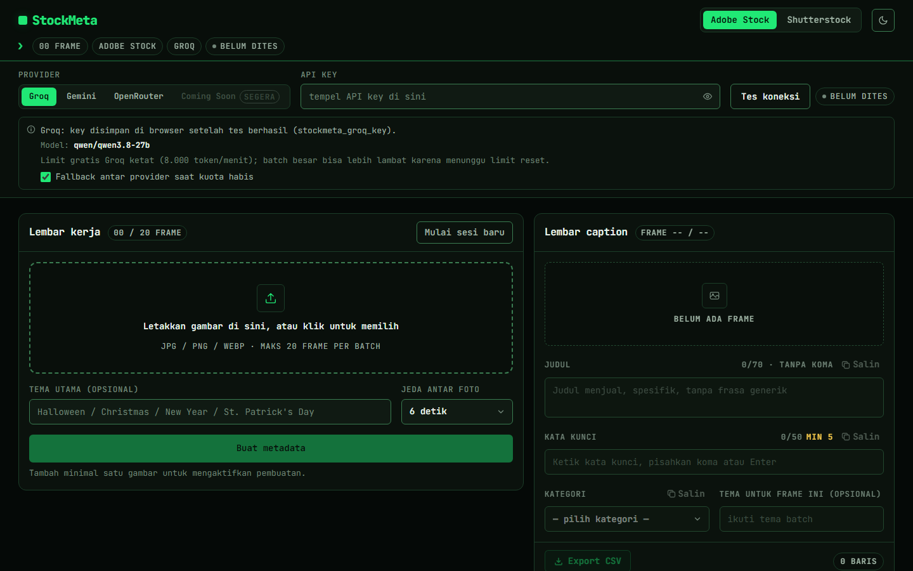

# StockMeta

Metadata AI untuk Adobe Stock dan Shutterstock: upload foto, biarkan AI menulis judul, kata kunci, dan kategori secara batch, lalu ekspor CSV sesuai format portal.

[](https://stockmeta-one.vercel.app)
[](https://nextjs.org/)
[](https://react.dev/)
[](https://www.typescriptlang.org/)
[](https://tailwindcss.com/)
[](https://vitest.dev/)
[](./LICENSE)

[Demo Live](https://stockmeta-one.vercel.app) • [Laporkan Bug](https://github.com/akndrn000/stockmeta/issues) • [Dokumentasi](./docs/DESIGN.md)



## Ringkasan

Kontributor foto stok membutuhkan metadata yang akurat untuk setiap foto: judul, kata kunci, dan kategori sesuai aturan Adobe Stock dan Shutterstock. StockMeta mengerjakannya secara batch langsung di browser: API key milik pengguna (Groq atau Gemini) dikirim dari browser ke provider tanpa perantara server aplikasi, dan hasilnya dapat disunting lalu diekspor sebagai CSV siap impor.

## Daftar Isi

- [Ringkasan](#ringkasan)
- [Fitur](#fitur)
- [Cara Pakai](#cara-pakai)
- [Provider AI](#provider-ai)
- [Format CSV](#format-csv)
- [Keamanan dan Privasi](#keamanan-dan-privasi)
- [Memulai (Development)](#memulai-development)
- [Testing dan Kualitas](#testing-dan-kualitas)
- [Deploy](#deploy)
- [Struktur Folder](#struktur-folder)
- [Batasan yang Diketahui](#batasan-yang-diketahui)
- [Kontribusi](#kontribusi)
- [Lisensi dan Disclaimer](#lisensi-dan-disclaimer)

## Fitur

- Upload sampai **20 frame** per batch (JPG/PNG/WEBP) lewat drag-drop atau tombol pilih file.
- Dua platform dalam satu sesi: **Adobe Stock** dan **Shutterstock**. Ganti platform tanpa kehilangan hasil karena metadata tersimpan per platform.
- Generate metadata batch: berurutan, bisa dibatalkan, retry otomatis saat kena limit, dan status per frame (menunggu / memproses / siap / gagal).
- Fallback antar provider: kuota harian habis atau `503` setelah retry habis membuat frame dialihkan ke provider lain yang key-nya tersimpan. Toggle di panel provider, default aktif.
- Edit manual per frame: judul atau deskripsi, kata kunci berbentuk chip, kategori resmi, tema per foto, dan saran perbaikan non-pemblokir.
- Ekspor CSV sesuai template resmi portal, atau salin per field dengan satu klik.
- Jeda antar foto dapat diatur (3/6/12/20 detik, default 6 detik) untuk menghindari limit.
- Mode siang/malam (mengikuti sistem, bisa di-override), sesi tersimpan otomatis di browser.

## Cara Pakai

1. **Upload** foto ke Lembar kerja (drag-drop atau klik area upload).
2. **Pilih platform** (Adobe Stock / Shutterstock) di header.
3. **Pilih provider** (Groq sebagai default, atau Gemini) lalu **tempel API key** Anda.
4. Klik **Tes koneksi**. Key hanya disimpan kalau tes lulus.
5. Isi **tema batch** (opsional), misalnya `Halloween`.
6. Klik **Buat metadata**. Progress tampil per frame dan bisa **Batalkan** kapan saja.
7. **Edit** hasilnya di Lembar caption (judul/deskripsi, kata kunci, kategori).
8. **Salin** per field, atau klik **Export CSV** untuk mengunduh file CSV.

## Provider AI

Setiap provider memakai **satu model tetap**, tanpa pemilihan model dinamis. Nama model di bawah diverifikasi dari `src/lib/providers/models.ts`.

| Provider | Model | Batas gratis |
| --- | --- | --- |
| **Groq** (default) | `qwen/qwen3.8-27b` | Perkiraan ±8.000 token/menit, dapat berubah sewaktu-waktu. Lihat [dokumentasi limit Groq](https://console.groq.com/docs/rate-limits). |
| **Gemini** | `gemini-3.5-flash-lite` | Kuota harian gratis. `429` bertanda kuota harian habis berarti kuota hari itu habis. Lihat [dokumentasi rate limit Gemini](https://ai.google.dev/gemini-api/docs/rate-limits). |
| **OpenRouter** (cadangan) | `openrouter/free` | Perkiraan ±20 request/hari tanpa isi saldo, dapat berubah sewaktu-waktu. Lihat [dokumentasi OpenRouter](https://openrouter.ai/docs). |

Perilaku retry dan fallback (lihat `src/lib/providers/retry.ts` dan `src/lib/providers/fallback.ts`):

- Limit per menit (`429` biasa) di-retry otomatis: total maksimal **3 percobaan**, menunggu ±20 detik atau sesuai header `retry-after`.
- Error `503`/sibuk di-retry dengan backoff 5 detik lalu 10 detik.
- Kuota **harian** habis (`429` bertanda kuota harian) tidak di-retry. Frame dialihkan ke provider lain yang key-nya tersimpan, atau gagal dengan pesan yang jelas bila tidak ada key cadangan.
- Fallback bisa dimatikan lewat toggle **Fallback antar provider** di panel provider (default aktif).

Tips: kalau sering muncul pemberitahuan **"Menunggu limit reset"**, naikkan **Jeda antar foto** (misalnya 12 atau 20 detik) di Lembar kerja. Frame yang tetap gagal bisa diproses ulang lewat tombol **Coba lagi frame gagal**.

## Format CSV

Ekspor mengikuti template resmi masing-masing portal (lihat `src/lib/csv.ts` dan `src/lib/validate.ts`).

| Aturan | **Adobe Stock** | **Shutterstock** |
| --- | --- | --- |
| Kolom | `Filename, Title, Keywords, Category, Releases` | `Filename, Description, Keywords, Categories` |
| Judul / deskripsi | Judul maks 70 karakter dan **tanpa koma**. Koma otomatis diganti spasi saat ekspor | Deskripsi berupa kalimat utuh, bukan daftar kata |
| Kategori | Berupa **nomor** (1–21) sesuai daftar resmi Adobe; kolom `Releases` dikosongkan | **1–2 nama** resmi dalam satu sel, dipisah koma |
| Kata kunci | Satu sel dipisah koma, maksimal 50 | Satu sel dipisah koma, maksimal 50 |
| Nama file | Saran bila melebihi 30 karakter (termasuk ekstensi) | Tidak ada batas khusus di aplikasi |

Catatan tambahan:

- Judul yang dihasilkan AI dibatasi 70 karakter saat parsing. Edit manual yang melebihi batas tidak dipotong diam-diam saat ekspor, melainkan memunculkan saran validasi.
- Hanya baris yang sudah punya isi untuk platform tersebut yang diekspor. File dikirim sebagai UTF-8 dengan BOM dan baris CRLF, plus proteksi injeksi formula untuk sel berawalan `=`, `+`, `-`, atau `@`.
- Saran validasi lain (kata kunci minimal 5 untuk Adobe dan 7 untuk Shutterstock, deskripsi minimal 5 kata, kategori wajib diisi) bersifat non-pemblokir.
- **Sebaiknya impor CSV hasil unduhan ke portal masing-masing sekali dulu** untuk memastikan formatnya diterima sebelum dipakai untuk banyak file.

## Keamanan dan Privasi

- API key disimpan di **localStorage browser** (`stockmeta_groq_key`, `stockmeta_gemini_key`, `stockmeta_openrouter_key`) dan hanya ditulis setelah tes koneksi lulus.
- Key dan gambar dikirim **langsung dari browser ke server provider** (`api.groq.com`, `generativelanguage.googleapis.com`, `openrouter.ai`). Repo ini tidak punya API route backend, jadi tidak ada server perantara.
- Yang dikirim ke provider: API key (sebagai otorisasi), teks prompt, dan gambar dalam format base64. Yang tidak dikirim ke mana pun selain provider: tidak ada server aplikasi yang menerima data, dan tidak ada analytics atau pelacak di kode.
- Gunakan **API key khusus** untuk aplikasi ini (bukan key utama Anda) dan batasi haknya di konsol provider.
- **Jangan memakai komputer bersama** tanpa menghapus sesi. Siapa pun yang membuka browser yang sama bisa melihat key tersimpan. Ada tombol lihat/sembunyikan key, dan Anda bisa menghapusnya dari field.

## Memulai (Development)

Stack: Next.js 16 (App Router), React 19, TypeScript strict, Tailwind CSS v4, Vitest + jsdom, ESLint. Font JetBrains Mono via `next/font`.

Prasyarat: Node.js (versi LTS disarankan) dan npm.

```bash
git clone https://github.com/akndrn000/stockmeta.git
cd stockmeta
npm install
npm run dev      # buka http://localhost:3000
```

Semua script npm (lihat `package.json`):

| Script | Fungsi |
| --- | --- |
| `npm run dev` | Menjalankan server development Next.js |
| `npm run build` | Build produksi |
| `npm run start` | Menjalankan hasil build produksi |
| `npm run lint` | Cek ESLint |
| `npm run test` | Unit test sekali jalan (Vitest run) |
| `npm run typecheck` | Cek tipe TypeScript tanpa emit (`tsc --noEmit`) |

Live-test provider manual (tidak ikut build, key hanya dibaca dari environment variable):

```bash
GEMINI_KEY=... npx tsx scripts/live-test.ts gemini foto.jpg adobe "Halloween"
GROQ_KEY=... npx tsx scripts/live-test.ts groq foto.jpg shutterstock
OPENROUTER_KEY=... npx tsx scripts/live-test.ts openrouter foto.jpg adobe
```

## Testing dan Kualitas

```bash
npm run test       # unit test (vitest)
npm run typecheck  # tsc --noEmit, harus 0 error
npm run lint       # eslint, harus 0 temuan
```

Konvensi kode (lihat `AGENTS.md` sebelum mengubah kode): satu modul satu seam dengan interface kecil. `src/lib/*` berisi logika murni tanpa DOM/React, `src/hooks/*` berisi state React, `src/components/*` berisi UI. Logika murni tidak mengimpor React dan provider tidak mengimpor komponen.

## Deploy

Tidak ada environment variable yang dibutuhkan. Semua key diisi pengguna di browser.

```bash
vercel deploy
```

Atau hubungkan repo ini ke Vercel Dashboard. Build default: `npm run build`.

## Struktur Folder

```text
src/
  app/            layout.tsx, page.tsx, globals.css (token warna), icon.svg
  components/     Header.tsx, ProviderPanel.tsx, Worksheet.tsx, CaptionSheet.tsx,
                  KeywordEditor.tsx, Panel.tsx, CopyButton.tsx, ThemeToggle.tsx,
                  LabelRow.tsx, Footer.tsx, InlineScript.tsx
  hooks/          useSession.ts, useProvider.ts, useBatch.ts, useTheme.ts
  lib/            batch.ts, csv.ts, prompt.ts, validate.ts, storage.ts, limits.ts,
                  categories.ts, metadata.ts, keywords.ts, frames.ts, image.ts,
                  fileStore.ts, types.ts, providers/
  lib/providers/  groq.ts, gemini.ts, openrouter.ts, fallback.ts, retry.ts,
                  models.ts, types.ts, index.ts, http.ts
scripts/          live-test.ts (tes provider manual, tidak ikut build)
docs/             DESIGN.md (sistem desain), MIGRATION.md (riwayat migrasi),
                  screenshot.png
```

## Batasan yang Diketahui

- **Maksimal 20 frame per batch.**
- **File asli tidak disimpan setelah refresh.** Sesi menyimpan thumbnail dan metadata saja. Untuk generate ulang, upload ulang gambar dengan nama yang sama.
- **Hasil AI tetap perlu ditinjau manual.** Subjek bisa salah baca dan kata kunci perlu dikurasi. Batas portal (misalnya judul Adobe 70 karakter) hanya berupa saran, kecuali pemotongan 70 karakter pada output mentah model.
- **Kategori bisa terisi otomatis oleh sistem** bila nama dari model tidak cocok dengan daftar resmi. Hasil seperti ini ditandai dengan saran "Kategori dipilih otomatis oleh sistem, periksa kembali."

## Kontribusi

1. Fork repo ini dan buat branch dari `main`.
2. Baca `AGENTS.md` sebelum mengubah kode dan ikuti konvensi modul yang ada.
3. Pastikan semua cek lolos sebelum membuka PR:

```bash
npm run lint && npm run typecheck && npm run test
```

4. Buka pull request dengan deskripsi singkat tentang perubahan Anda. Jangan menambah file `CONTRIBUTING.md` baru.

## Lisensi dan Disclaimer

Dilisensikan di bawah **MIT** — lihat file [LICENSE](./LICENSE) untuk teks lengkapnya (© 2026 akndrn000).

"Adobe Stock", "Shutterstock", "Groq", dan "Gemini/Google" adalah merek dagang pemiliknya masing-masing. Proyek ini tidak berafiliasi dengan, disponsori, atau didukung oleh mereka.
