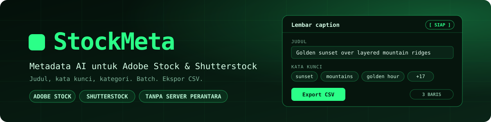
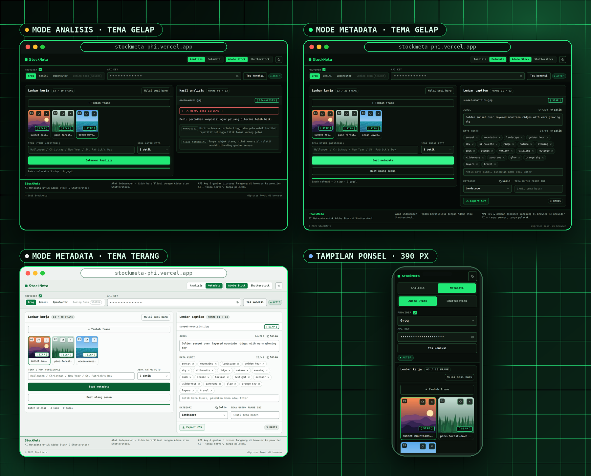
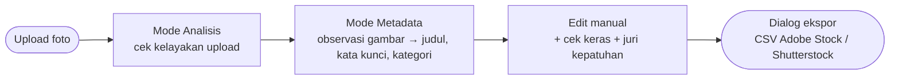

<div align="center">



<br>

[](https://stockmeta-phi.vercel.app)
[](https://nextjs.org/)
[](https://react.dev/)
[](https://www.typescriptlang.org/)
[](https://tailwindcss.com/)
[](https://vitest.dev/)
[](./LICENSE)

**[Demo Live](https://stockmeta-phi.vercel.app) · [Fitur](#fitur) · [Cara Pakai](#cara-pakai) · [Mode Analisis](#mode-analisis) · [Provider AI](#provider-ai) · [Format CSV](#format-csv) · [Keamanan](#keamanan-dan-privasi) · [FAQ](#faq) · [Laporkan Bug](https://github.com/akndrn000/stockmeta/issues)**

<br>

<a href="https://stockmeta-phi.vercel.app">
  
</a>

<br>

**2** mode &nbsp;·&nbsp; **3** provider AI &nbsp;·&nbsp; **2** platform stok &nbsp;·&nbsp; **20** frame per batch &nbsp;·&nbsp; **0** server perantara &nbsp;·&nbsp; juri sampai **3**

<sub>Gambar, hasil analisis, dan metadata pada tangkapan layar adalah data contoh untuk ilustrasi.</sub>

</div>

<br>

## Tentang StockMeta

Kontributor foto stok perlu memastikan fotonya layak diterima, lalu menyiapkan judul, kata kunci, dan kategori yang sesuai aturan tiap portal. StockMeta mengerjakan keduanya secara batch langsung di browser, lewat dua mode:

- **Mode Analisis** menilai kelayakan upload tiap foto.
- **Mode Metadata** menulis judul atau deskripsi, kata kunci, dan kategori, lalu mengekspornya sebagai **CSV** siap impor untuk **Adobe Stock** atau **Shutterstock**.

API key milikmu (Groq, Gemini, atau OpenRouter) dikirim dari browser langsung ke provider, tanpa server perantara.



## Fitur

| | |
| --- | --- |
| **Batch sampai 20 frame** | Upload JPG, PNG, atau WEBP lewat drag-drop atau tombol pilih file. |
| **Mode Analisis** | AI berperan sebagai reviewer stok dan menilai tiap foto: Layak, Berpotensi ditolak, atau Perlu tinjau, lengkap dengan daftar masalah. |
| **Dua platform** | Adobe Stock dan Shutterstock dalam satu sesi. Hasil tersimpan per platform, jadi berganti platform tidak menghilangkan pekerjaan. |
| **Batch yang tangguh** | Berurutan, bisa dibatalkan, retry otomatis saat kena limit, dengan status per frame (menunggu, memproses, siap, gagal). |
| **Fallback antar provider** | Saat kuota harian habis atau terjadi `503` setelah retry habis, frame dialihkan ke provider lain yang key-nya tersimpan. Bisa dimatikan. |
| **Edit manual** | Judul atau deskripsi, kata kunci berbentuk chip, kategori resmi, tema per foto, nama file di portal, toggle Ilustrasi/Editorial (Shutterstock), dan cek keras yang memblokir (error) vs saran (warning). |
| **Ekspor CSV** | Mengikuti template resmi portal, dialog pra-unduh berisi daftar Filename, hanya baris lolos cek keras yang ditulis, atau salin per field dengan satu klik. |
| **Juri kepatuhan** | Hingga 3 provider menilai tiap frame per platform (LOLOS / DENGAN CATATAN / TIDAK LOLOS / PERLU DITINJAU) — selalu saran, bukan keputusan platform. |
| **Jeda antar foto** | Dapat diatur 3, 6, 12, atau 20 detik (default 6) untuk menghindari limit. |
| **Nyaman dipakai** | Mode siang/malam (mengikuti sistem, bisa di-override) dan sesi tersimpan otomatis di browser. |

## Cara Pakai

1. **Upload** foto ke *Lembar kerja* (drag-drop atau klik area upload).
2. **Pilih platform**, Adobe Stock atau Shutterstock, di header.
3. **Pilih provider** (Groq sebagai default, Gemini, atau Custom OpenAI-compatible dengan base URL + model + key sendiri) lalu **tempel API key**.
4. Klik **Tes koneksi**. Key hanya disimpan kalau tes lulus, dan key yang tersimpan dites ulang otomatis saat halaman dimuat ulang.
5. Buka **Mode Analisis**, lalu klik **Jalankan Analisis**. Hasil tiap foto tampil di panel *Hasil analisis*.
6. Pindah ke **Mode Metadata**, isi **tema batch** (opsional, misalnya `Halloween`), lalu klik **Buat metadata**. Setiap frame diamati gambarnya (Tahap A, di-cache), lalu dibuatkan metadata dari hasil pengamatan (Tahap B), diperiksa kepatuhannya (Tahap C), dan diverifikasi grounding-nya bila **Verifikasi ketat** aktif (Tahap D, default aktif).
7. **Edit** hasilnya di *Lembar caption* (termasuk **Nama file di portal**). Kotak merah = error cek keras yang memblokir ekspor frame itu; kotak kuning = saran.
8. Buka panel **Kepatuhan**: periksa pengamatan, jalankan **Periksa kepatuhan** (pilih 1–3 juri), dan opsional **Perbaiki sesuai saran juri** (selalu minta konfirmasi, tidak menimpa diam-diam).
9. Klik **Export CSV**, periksa dialog (daftar Filename + error/peringatan), lalu **Unduh**.
10. Kerjakan **Langkah manual di portal** yang tidak bisa lewat CSV (lihat panel Kepatuhan).

> [!NOTE]
> Pembuatan metadata **digerbang oleh analisis**. Frame yang belum dianalisis pada platform aktif dilewati dengan pesan *"Jalankan Analisis dulu di Mode Analisis"*. Gerbang ini hanya berlaku saat memulai pembuatan; data yang sudah ada tetap bisa diedit manual.

> [!TIP]
> Bila sering muncul **"Menunggu limit reset"**, naikkan **Jeda antar foto** (pilihan 3, 6, 12, atau 20 detik; default 6). Frame yang tetap gagal bisa diproses ulang lewat tombol **Coba lagi frame gagal**.

## Mode Analisis

Mode ini berperan berlawanan dengan Mode Metadata: AI menjadi **reviewer stok** yang hanya menilai, tanpa membuat judul, deskripsi, atau kata kunci. Prompt dan parser ada di `src/lib/analysisPrompt.ts`.

| Verdict | Arti |
| --- | --- |
| **Layak** | Tidak ada masalah yang terlihat pada gambar. |
| **Berpotensi ditolak** | Ada masalah yang jelas terlihat dan berisiko membuat foto ditolak. |
| **Perlu tinjau** | Ada hal yang perlu diperiksa manusia, misalnya kemiripan dengan konten lain. |

Setiap masalah dikelompokkan ke salah satu dari delapan kategori: kualitas gambar, konten serupa, watermark/logo, hak cipta/merek, properti/model release, komposisi, nilai komersial, dan lainnya.

- Penilaian hanya berdasarkan apa yang **terlihat di gambar**. AI diminta tidak mengarang masalah, dan verdict ditampilkan dengan warna, ikon, dan teks sekaligus.
- Hasil tersimpan **per platform**, jadi analisis Adobe Stock tidak menimpa analisis Shutterstock.
- Analisis memakai provider, jeda antar foto, retry, dan fallback yang sama dengan Mode Metadata. Tiap foto bisa dianalisis ulang lewat tombol ulang di tile.
- Mode terakhir yang dipakai diingat di browser, dan mode terkunci selama batch berjalan.

> [!WARNING]
> Hasil analisis adalah **saran AI, bukan jaminan** diterima atau ditolak. AI tidak punya akses ke database platform, sehingga kemiripan dengan konten lain hanya dapat ditandai sebagai *perlu tinjau*, bukan dipastikan.

## Alur Analisis dan Juri Metadata

Mode Metadata bekerja dalam 4 tahap per frame (lihat `src/lib/pipeline.ts`):

1. **A — Pengamatan:** gambar asli dikirim ke vision AI (diperkecil ~1280px JPEG ~0.8). Hasil JSON (subjek, orang, teks/merek terlihat, kualitas, confidence) di-cache di sesi — ganti platform tidak mengamati ulang. Provider tanpa dukungan gambar menghentikan frame dengan error jelas, tanpa mode teks-saja.
2. **B — Metadata:** teks observasi (tanpa gambar, tanpa nama file) diubah menjadi judul/deskripsi + keyword + kategori sesuai aturan tiap platform.
3. **C — Kepatuhan deterministik:** merek terlihat, wajah dikenali, properti privat, media non-foto, indikasi AI, dan confidence rendah menjadi peringatan di panel Kepatuhan.
4. **D — Verifikasi grounding** (toggle, default aktif): keyword yang tak didukung gambar dihapus secara terlihat; bila sisa di bawah minimum, diregenerasi 1x atau error `keyword tidak cukup`.

**Juri kepatuhan** (`src/lib/judge.ts`, `src/hooks/useJudge.ts`): 1–3 provider menilai metadata + observasi (+ gambar bila toggle aktif) berdasar blok aturan dari `platform-rules.ts`. Satu error cek keras = TIDAK LOLOS apa pun kata juri. Hasil selalu berlabel *"Perkiraan kelolosan (saran, bukan keputusan platform)"*. Tombol **Perbaiki sesuai saran juri** mengirim revisi ke satu provider, melewati cek keras ulang, menampilkan diff, dan meminta konfirmasi — tidak menimpa edit manual diam-diam.

## Provider AI

Setiap provider fixed memakai **satu model tetap**, tanpa pemilihan model dinamis (lihat `src/lib/providers/models.ts`). Provider ketiga adalah adapter **Custom OpenAI-compatible** generik: base URL + model + key diisi sendiri (tanpa hardcode nama layanan), tersimpan di browser.

| Provider | Model | Batas gratis |
| --- | --- | --- |
| **Groq** (default) | `qwen/qwen3.8-27b` | Perkiraan ±8.000 token/menit, dapat berubah sewaktu-waktu. [Dokumentasi limit](https://console.groq.com/docs/rate-limits) |
| **Gemini** | `gemini-3.5-flash-lite` | Kuota harian gratis; `429` bertanda kuota harian berarti kuota hari itu habis. [Dokumentasi rate limit](https://ai.google.dev/gemini-api/docs/rate-limits) |
| **Custom** | Diisi sendiri | Mengikuti akunmu di layanan itu. [Contoh yang kompatibel](https://openrouter.ai/docs) |

<details>
<summary><b>Perilaku retry dan fallback</b></summary>

<br>

Berdasarkan `src/lib/providers/retry.ts` dan `src/lib/providers/fallback.ts`:

- Limit per menit (`429` biasa) di-retry otomatis dengan total maksimal **3 percobaan**, menunggu ±20 detik atau sesuai header `retry-after`.
- Error `503` atau sibuk di-retry dengan backoff 5 detik lalu 10 detik.
- Kuota **harian** habis (`429` bertanda kuota harian) tidak di-retry. Frame dialihkan ke provider lain yang key-nya tersimpan, atau gagal dengan pesan yang jelas bila tidak ada key cadangan.
- Fallback bisa dimatikan lewat kotak centang di samping label **Provider** (default aktif).

</details>

## Format CSV

Ekspor mengikuti template resmi tiap portal (satu sumber kebenaran: `src/lib/platform-rules.ts`; logika di `src/lib/csv.ts`, cek keras di `src/lib/validate.ts`).

| Aturan | **Adobe Stock** | **Shutterstock** |
| --- | --- | --- |
| Kolom | `Filename, Title, Keywords, Category, Releases` | `Filename, Description, Keywords, Categories` (+ `Illustration, Mature content, Editorial` bila ada frame mengaktifkan toggle) |
| Judul / deskripsi | Frasa faktual ≤70 ideal (peringatan di 71–200), maks 200 (error); koma/karakter khusus disanitasi saat ekspor dan ditandai di editor; bukan daftar kata | Satu kalimat natural 60–200 karakter (saran), min 5 kata dan maks 2048 karakter (error); bukan daftar kata |
| Kategori | Berupa **nomor** (1–21) sesuai daftar resmi Adobe; kolom `Releases` dikosongkan | **1–2 nama** resmi dalam satu sel, dipisah koma |
| Kata kunci | Unik min 5, maks 49; 10 pertama memuat kata judul; tanpa data teknis | Unik min 7, maks 50; tanpa pengulangan stem; tanpa merek |
| Nama file | Kolom Filename = **Nama file di portal** (default nama upload), dipakai apa adanya — samakan ejaan + ekstensi (`.jpeg`, `.eps`, …) | Sama — samakan persis dengan portal |

- File bernama `StockMeta_Adobe_YYYY-MM-DD.csv` / `StockMeta_Shutterstock_YYYY-MM-DD.csv` (tanpa spasi), UTF-8 dengan BOM dan baris CRLF, plus proteksi injeksi formula untuk sel berawalan `=`, `+`, `-`, atau `@`. Maks 1 MB dan 5000 baris.
- Hanya baris berisi dan **lolos cek keras** yang diekspor; frame ber-error dilewati (tertera di dialog), frame TIDAK LOLOS juri hanya peringatan.
- Tidak ada pemotongan/penghapusan diam-diam: sanitasi judul dan dedupe keyword selalu terlihat di UI.

> [!IMPORTANT]
> **Uji impor pertama:** impor 2–3 foto ke portal masing-masing **sekali dulu** untuk memastikan formatnya diterima sebelum dipakai untuk banyak file. Cocokkan juga dropdown Kategori portal dengan daftar di aplikasi, dan periksa apakah judul ~100 karakter lolos impor Adobe.

## Keamanan dan Privasi

- **Tanpa server perantara.** Key dan gambar dikirim langsung dari browser ke server provider (`api.groq.com`, `generativelanguage.googleapis.com`, atau endpoint custom pilihanmu). Repo ini tidak memiliki API route backend, dan tidak ada analytics atau pelacak di kode.
- **Yang dikirim ke provider**, baik di Mode Analisis maupun Metadata: API key (sebagai otorisasi), teks prompt, dan gambar dalam format base64.
- **Juri kepatuhan** mengirim gambar + metadata ke **SEMUA juri aktif** — aplikasi meminta konfirmasi privasi sekali sebelum menilai.
- **API key** disimpan di localStorage browser (`stockmeta_groq_key`, `stockmeta_gemini_key`, `stockmeta_custom_key`) dan hanya ditulis setelah tes koneksi lulus. Konfigurasi custom (`stockmeta_custom_baseurl`, `stockmeta_custom_model`) juga di browser.
- **Preferensi non-sensitif** juga disimpan di localStorage: sesi (`stockmeta_session`, berisi thumbnail, metadata, observation, dan cache juri — bukan file asli), tema (`stockmeta_theme`), jeda antar foto (`stockmeta_batch_delay`), provider terpilih (`stockmeta_provider`), status fallback (`stockmeta_fallback`), mode aktif (`stockmeta_mode`), juri terpilih, verifikasi ketat, dan status privasi juri.
- **Gunakan API key khusus** untuk aplikasi ini (bukan key utamamu) dan batasi haknya di konsol provider.

> [!WARNING]
> **Jangan memakai komputer bersama** tanpa menghapus sesi. Siapa pun yang membuka browser yang sama dapat melihat key yang tersimpan. Tersedia tombol lihat/sembunyikan key, dan key dapat dihapus dari field-nya.

## FAQ

<details>
<summary><b>Apakah gambar saya diunggah ke server StockMeta?</b></summary>

<br>

Tidak. Aplikasi ini tidak punya backend. Gambar dikirim langsung dari browser ke provider AI yang kamu pilih. Setelah halaman dimuat ulang, sesi hanya menyimpan thumbnail dan metadata, bukan file aslinya.

</details>

<details>
<summary><b>Apakah saya perlu API key sendiri?</b></summary>

<br>

Ya. Kamu membawa key milikmu (Groq, Gemini, atau layanan OpenAI-compatible sendiri lewat provider Custom). Batas pemakaian mengikuti kuota akun provider masing-masing, bukan batas dari StockMeta.

</details>

<details>
<summary><b>Kenapa tombol "Buat metadata" melewati sebagian frame?</b></summary>

<br>

Pembuatan metadata digerbang oleh analisis. Frame yang belum dianalisis pada platform aktif dilewati sampai kamu menjalankan **Mode Analisis** terlebih dahulu.

</details>

<details>
<summary><b>Apa yang terjadi bila kuota provider habis di tengah batch?</b></summary>

<br>

Limit per menit di-retry otomatis. Bila kuota harian habis, frame dialihkan ke provider lain yang key-nya tersimpan (jika fallback aktif). Tanpa key cadangan, frame ditandai gagal dengan pesan yang jelas dan bisa dicoba lagi nanti.

</details>

<details>
<summary><b>Apakah verdict "Layak" / badge "LOLOS" menjamin foto diterima?</b></summary>

<br>

Tidak. Analisis dan juri adalah saran AI atas apa yang terlihat di gambar. Keputusan penerimaan tetap ada pada platform, dan kemiripan dengan konten lain tidak bisa dipastikan oleh AI.

</details>

## Pengembangan

**Stack:** Next.js 16 (App Router), React 19, TypeScript strict, Tailwind CSS v4, Vitest + jsdom, ESLint, dan font JetBrains Mono via `next/font`.

Prasyarat: Node.js (versi LTS disarankan) dan npm.

```bash
git clone https://github.com/akndrn000/stockmeta.git
cd stockmeta
npm install
npm run dev      # buka http://localhost:3000
```

| Script | Fungsi |
| --- | --- |
| `npm run dev` | Server development Next.js |
| `npm run build` | Build produksi |
| `npm run start` | Menjalankan hasil build produksi |
| `npm run lint` | Cek ESLint |
| `npm run test` | Unit test sekali jalan (Vitest) |
| `npm run typecheck` | Cek tipe TypeScript tanpa emit (`tsc --noEmit`) |

Sebelum membuka pull request, pastikan semua cek lolos:

```bash
npm run lint && npm run typecheck && npm run test
```

Konvensi kode ada di [`AGENTS.md`](./AGENTS.md): satu modul satu seam dengan interface kecil. `src/lib/*` berisi logika murni tanpa DOM/React, `src/hooks/*` berisi state React, dan `src/components/*` berisi UI. Logika murni tidak mengimpor React, dan provider tidak mengimpor komponen.

<details>
<summary><b>Struktur folder</b></summary>

<br>

```text
src/
  app/            layout.tsx, page.tsx, globals.css (token warna), icon.svg
  components/     Header, ModeToggle, ProviderPanel, Worksheet, CaptionSheet,
                  CompliancePanel, AnalysisPanel, KeywordEditor, Panel, CopyButton,
                  ThemeToggle, Footer, InlineScript
  hooks/          useSession, useProvider, useBatch, useAnalysisBatch, useJudge, useTheme
  lib/            batch, csv, prompt, analysisPrompt, observation, pipeline, judge,
                  validate, brands, platform-rules, storage, limits,
                  categories, metadata, keywords, frames, image, fileStore, types
  lib/providers/  groq, gemini, custom, fallback, retry, models, types, index, http
scripts/          live-test.ts (pipeline + juri + fixture manual, tidak ikut build)
docs/             DESIGN.md, MIGRATION.md, AUDIT.md, banner.svg, hero.png,
                  screenshots-mobile/ dan screenshots-m29/ (bukti audit)
```

</details>

<details>
<summary><b>Live-test provider manual</b></summary>

<br>

Skrip ini tidak ikut build. Key hanya dibaca dari environment variable. Menjalankan pipeline penuh (observasi → metadata → grounding + cek keras), opsional dengan `--judge`.

```bash
GEMINI_KEY=... npx tsx scripts/live-test.ts gemini foto.jpg adobe "Halloween"
GROQ_KEY=... npx tsx scripts/live-test.ts groq foto.jpg shutterstock --judge
CUSTOM_KEY=... CUSTOM_BASE_URL=... CUSTOM_MODEL=... npx tsx scripts/live-test.ts custom foto.jpg adobe
# 3 fixture PNG kecil untuk smoke teknis (polos + pola):
npx tsx scripts/live-test.ts --make-fixtures ./tmp-fixtures
```

</details>

## Deploy

Tidak ada environment variable yang dibutuhkan, karena semua key diisi pengguna di browser.

```bash
vercel deploy
```

Atau hubungkan repo ini ke Vercel Dashboard dengan build default `npm run build`.

## Batasan yang Diketahui

- **Maksimal 20 frame per batch.**
- **File asli tidak disimpan setelah refresh.** Sesi menyimpan thumbnail, metadata, observation, dan cache juri saja. Untuk generate ulang, upload ulang gambar dengan nama yang sama.
- **Hasil AI dan juri tetap perlu ditinjau manual** dan tidak pernah diklaim "dijamin lolos". Batas portal yang keras (judul Adobe >200, keyword di bawah minimum, deskripsi Shutterstock <5 kata/>2048) memblokir ekspor frame itu; sisanya saran.
- **Kategori bisa terisi otomatis oleh sistem** bila nama dari model tidak cocok dengan daftar resmi. Hasil seperti ini ditandai *"Kategori dipilih otomatis oleh sistem, periksa kembali"* — dan bila tetap di luar daftar setelah retry, kategori dikosongkan + ditandai perlu ditinjau (tidak lolos diam-diam).

## Kontribusi

1. Fork repo ini dan buat branch dari `main`.
2. Baca [`AGENTS.md`](./AGENTS.md) dan ikuti konvensi modul yang ada.
3. Jalankan `npm run lint && npm run typecheck && npm run test` sampai semuanya lolos.
4. Buka pull request dengan deskripsi singkat tentang perubahanmu.

Menemukan bug atau punya usulan? Buka [issue](https://github.com/akndrn000/stockmeta/issues).

## Lisensi dan Disclaimer

Dilisensikan di bawah **MIT**. Lihat [LICENSE](./LICENSE) (© 2026 akndrn000).

"Adobe Stock", "Shutterstock", "Groq", dan "Gemini/Google" adalah merek dagang pemiliknya masing-masing. Proyek ini tidak berafiliasi dengan, disponsori, atau didukung oleh mereka.
